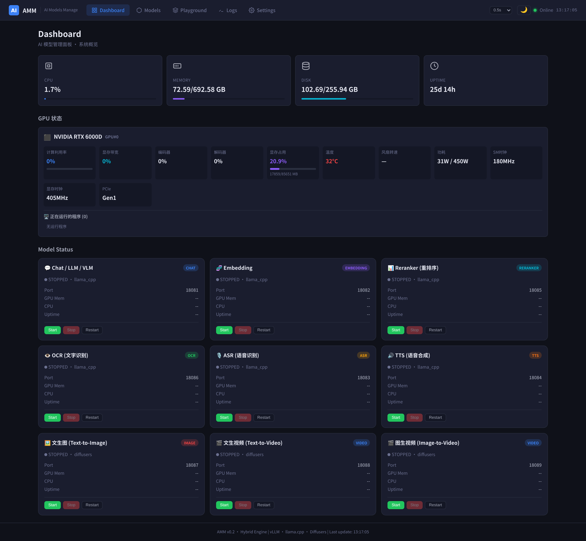

# AMM — AI Models Manage

> 混合推理引擎架构下的 AI 模型统一管理与调度平台

[](https://github.com/ggerganov/llama.cpp)
[](https://python.org)
[](LICENSE)

## 项目信息

- **负责人（撞强）**：xt@pcd.name ｜ 微信：13808230006
- **MaaS 服务供应商**：北京积算（icompify）— <https://www.icompify.com/>

### 界面预览



> 更多产品截图见 [docs/screenshots/](./docs/screenshots/)（Dashboard / Models / Playground / Logs / Settings）

## 特性

- **混合推理引擎**: 支持 llama.cpp (GGUF) / vLLM / Diffusers 三种后端，可自由切换
- **9 类 AI 模型**: Chat / Embedding / ASR / TTS / Reranker / OCR / T2I / T2V / I2V
- **OpenAI 兼容 API**: `/v1/chat/completions`, `/v1/embeddings`, `/v1/images/generations`, `/v1/videos/generations`
- **FP8 量化 (Diffusers)**: Wan2.2-A14B MoE 自动启用 FP8 存储+BF16 计算，84G 显存可跑 27B 视频模型
- **网页端高级配置**: Quant / CPU Offload / Boundary Ratio / Compute Dtype 一键切换
- **🔎 模型文件路径浏览 (v0.2)**: 先选引擎 → 浏览 /models 目录选模型文件 → 自动识别可调参数
- **⚙️ 预设配置 (v0.2)**: 模型旁放 `<model>.vllm` / `<model>.llamacpp`（YAML/JSON）即可一键加载预设参数
- **💬 Playground 9 类模型测试 (v0.3)**: chat(流式实测 TTFT/TPS/端到端) / embedding / asr / tts / rerank / ocr / t2i / t2v / i2v 全类型测试 + 性能统计
- **🔤 会话参数与多轮 (v0.2)**: 模型选择、Temperature/MaxTokens/Top-P/System、多轮历史持久化、图片视觉上传
- **🚀 启动命令编排 (v0.6)**: Chat/LLM/VLM 可基于参数一键生成完整启动命令行 → 人工修改 → 保存为启动脚本，start/stop/restart 优先执行自定义脚本
- **🧠 --reasoning-budget (v0.6)**: llama.cpp 支持限制 Qwen3 等思考模型 reasoning token 上限，防空回复；Playground Chat 默认 max_tokens 提升至 16384
- **📊 Dashboard GPU (v0.3)**: GPU 状态移到首页第二行多列——型号/计算利用率/显存带宽/编码解码/显存占用/温度/风扇/功耗/时钟/PCIe
- **⚙️ 引擎参数完善 (v0.3)**: Chat 支持 llama.cpp 26 项 + vLLM 18 项运行参数（含 prefix caching/chunked prefill/KV cache/量化/采样，取自 AKVD 知识库检索）
- **🛠 Settings 运维 (v0.2)**: 重载配置、重启服务、下载日志
- **浅色主题**: 🌙/☀️ 一键切换，localStorage 持久记忆
- **引擎版本管理**: 网页端安装/卸载不同版本引擎
- **实时监控**: GPU / CPU / 内存 / 磁盘监控，模型运行状态实时刷新

## 架构

```
┌─────────────────────────────────────────────┐
│            AMM Web UI (Frontend)             │
│   Dashboard │ Models │ GPU │ Logs │ Settings │
└─────────────┬───────────────────────────────┘
              │ REST API
┌─────────────▼───────────────────────────────┐
│          AMM Backend Server                  │
│  ┌──────────┬──────────┬──────────────────┐ │
│  │ Engine   │ Version  │ Model Manager    │ │
│  │ Registry │ Manager  │ (Lifecycle)      │ │
│  └────┬─────┴────┬─────┴────────┬─────────┘ │
│       │          │              │           │
│  ┌────▼────┐ ┌──▼───┐    ┌─────▼──────┐   │
│  │llama.cpp│ │vLLM  │    │Diffusers   │   │
│  │ (GGUF)  │ │(safet│    │(ModelScope)│   │
│  └─────────┘ └──────┘    └────────────┘   │
└─────────────────────────────────────────────┘
```

## 快速开始

### 1. 环境要求

- Linux (Rocky Linux 9 / Ubuntu 22.04 / Debian 12)
- Python 3.11+
- NVIDIA GPU（推荐 RTX 6000D / A100 / H100，显存 ≥48G）
- CUDA 13.2+（需支持 Blackwell sm_120，本项目使用 torch 2.11.0+cu130）

### 2. 安装

```bash
# 克隆仓库
git clone http://10.10.10.10:60005/iei/amm.git /amm
cd /amm

# 运行安装脚本 (容器内首次使用)
bash deploy/install.sh
```

### 3. 启动服务

```bash
# 方式1: 手动启动
export PYTHONPATH=/amm
export AMM_ROOT=/amm
export MODELS_DIR=/models
python3.11 /amm/backend/server.py

# 方式2: 使用容器启动脚本
bash deploy/container_start.sh
```

### 4. 访问 Web 界面

打开浏览器访问: `http://<服务器IP>:60006/`

> 统一 Web 入口（容器内 80，宿主映射 60006）：
> - `http://<host>:60006/` 直接打开 AMM WebUI 管理页面
> - `http://<host>:60006/api/*` 管理/推理接口
> - `http://<host>:60006/v1/*` OpenAI 兼容 API（chat/embedding/asr/tts/ocr/images/videos）
>
> OpenAI 客户端 base_url 填：`http://<服务器IP>:60006/v1`

### 5. Docker Compose 部署

```bash
cd deploy
docker compose up -d
# 进入容器执行安装
docker exec -it amm-server bash
bash /amm/deploy/install.sh
python3.11 /amm/backend/server.py
```

> 端口映射（`docker-compose.yml`）：`60006->80`(Web/API 统一入口)、`60007->443`(HTTPS 预留)、`62220->22`(SSH)。

## 目录结构

```
/amm/
├── backend/
│   ├── api/               # API 桥接 (OpenAI / Diffusers)
│   ├── core/              # 核心引擎抽象 / 模型管理
│   ├── engines/           # 引擎实现 (llama_cpp / vllm / diffusers)
│   ├── config/            # models_config.yaml
│   └── server.py          # 主服务入口
├── frontend/              # Web UI (9类测试 Playground / GPU Dashboard / 主题切换)
├── deploy/                # 部署脚本 (docker-entrypoint 容器入口)
├── logs/                  # 运行日志
└── docs/                  # 文档 (开发/升级记录/参数调优指南/成果汇总)
```

## API 接口

### 系统接口

| 接口 | 方法 | 说明 |
|------|------|------|
| `/api/health` | GET | 健康检查 |
| `/api/system` | GET | 系统信息 |
| `/api/gpu` | GET | GPU 状态 |
| `/api/instances` | GET | 所有模型实例 |
| `/api/engines` | GET | 引擎列表 |
| `/api/engines/versions` | GET | 引擎版本 |

### 模型管理

| 接口 | 方法 | 说明 |
|------|------|------|
| `/api/instances/{id}/start` | POST | 启动模型 |
| `/api/instances/{id}/stop` | POST | 停止模型 |
| `/api/instances/{id}/restart` | POST | 重启模型 |
| `/api/instances/{id}/parameters` | PUT | 更新运行参数 |
| `/api/instances/{id}/advanced` | GET/PUT | 读取/更新 Diffusers 高级配置（Quant/CPU Offload等） |
| `/api/instances/{id}/engine` | PUT | 切换引擎 |
| `/api/instances/{id}/logs` | GET | 查看日志 |
| `/api/instances/{id}/command` | GET/PUT/DELETE | 查看/保存/清除自定义启动命令 (v0.6) |
| `/api/instances/{id}/command/preview` | POST | 基于当前参数生成实际启动命令行 (v0.6) |

### OpenAI 兼容

| 接口 | 方法 | 说明 |
|------|------|------|
| `/v1/models` | GET | 模型列表 |
| `/v1/chat/completions` | POST | 对话生成（支持流式 stream） |
| `/v1/embeddings` | POST | 文本嵌入 |
| `/v1/audio/transcriptions` | POST | 语音转文字 (ASR) |
| `/v1/audio/speech` | POST | 文字转语音 (TTS) |
| `/v1/ocr` | POST | 图片文字识别 |
| `/v1/rerank` | POST | 重排序 (llama.cpp --reranking) |
| `/v1/images/generations` | POST | 文生图 (T2I) |
| `/v1/videos/generations` | POST | 视频生成 (T2V/I2V, video_type=t2v\|i2v) |

### 文件浏览 / 预设 (v0.2)

| 接口 | 方法 | 说明 |
|------|------|------|
| `/api/fs/list` | GET | 浏览 /models 目录树（多级导航） |
| `/api/fs/discover` | GET | 按引擎发现模型文件 |
| `/api/instances/preset` | GET/POST | 查找/应用/保存预设配置 |

### 运维 (v0.2)

| 接口 | 方法 | 说明 |
|------|------|------|
| `/api/settings/reload` | POST | 热重载配置 |
| `/api/settings/restart` | POST | 安全重载+实例刷新 |

## 引擎支持矩阵

| 模型类别 | llama.cpp | vLLM | Diffusers |
|----------|:---------:|:----:|:---------:|
| Chat / LLM | ✅ | ✅ | ❌ |
| Embedding | ✅ | ✅ | ❌ |
| ASR | ✅ | ❌ | ❌ |
| TTS | ✅ | ❌ | ❌ |
| Reranker | ✅ | ❌ | ❌ |
| OCR | ✅ | ❌ | ❌ |
| Text-to-Image | ❌ | ❌ | ✅ |
| Text-to-Video | ❌ | ❌ | ✅ |
| Image-to-Video | ❌ | ❌ | ✅ |

## 配置模型

编辑 `backend/config/models_config.yaml`：

```yaml
chat_model:
  id: "chat"
  engine_type: "llama_cpp"   # 或 "vllm"
  available_models:
    - name: "Qwen3.6-35B"
      file: "HauhauCS/.../Qwen3.6-35B-A3B-Uncensored-HauhauCS-Aggressive-Q4_K_M.gguf"
  parameters:
    # llama.cpp 思考预算 (v0.6): 限制 Qwen3 思考 token, 防空回复
    - name: "reasoning_budget_enabled"
      type: "boolean"
      default: false
      engine: "llama_cpp"
    - name: "reasoning_budget"
      type: "number"
      default: 8192
      engine: "llama_cpp"
```

模型文件存放在 `/models/` 目录，路径相对于 `/models`。

## 开发

```bash
# 安装开发依赖
pip3.11 install -r backend/requirements.txt

# 运行测试
cd /amm
PYTHONPATH=/amm python3.11 -m backend.server
```

## 路线图

- [x] 混合引擎架构 (llama.cpp / vLLM / Diffusers)
- [x] 引擎版本管理 (安装/卸载)
- [x] 9 类模型统一配置
- [x] OpenAI 兼容 API (chat/embeddings/images/videos)
- [x] Web 前端 (Dashboard / Playground / GPU 监控 / Settings)
- [x] Dashboard GPU 状态多列展示 (v0.3)
- [x] Playground 9 类模型测试 + 性能 (TTFT/TPS/端到端) (v0.3)
- [x] Chat 引擎参数完善 (llama.cpp 26 / vLLM 18 项, AKVD 知识库) (v0.3)
- [x] 统一 web/API 端口 60006 (v0.2)
- [x] 模型文件浏览器 + 预设配置 (v0.2)
- [x] vLLM CUDA13 + Blackwell sm_120 验证 (0.22.1)
- [x] Diffusers FP8 layerwise_casting (Wan2.2 MoE)
- [x] Diffusers T2I 推理验证 (Qwen-Image-2512)
- [x] Diffusers T2V 冷启动验证 (Wan2.2-A14B, 峰值15.9G显存)
- [x] Diffusers T2V/I2V 完全验证 (Wan2.2-A14B) (v0.4)
- [x] vLLM FlashInfer/ninja 修复 + Qwen3 启动验证 (v0.6)
- [x] 启动命令编排 (按参数生成/编辑/保存启动脚本) (v0.6)
- [x] llama.cpp --reasoning-budget 限制 Qwen3 思考 token 防空回复 (v0.6)
- [ ] 模型自动下载 (HuggingFace / ModelScope)
- [ ] 权限管理与多用户
- [ ] 模型量化转换工具 (GGUF)

## 文档索引

| 文档 | 内容 |
|------|------|
| `CHANGELOG.md` | 版本变更日志 |
| `docs/项目工作成果汇总.md` | 截止当前全部工作汇总 |
| `docs/引擎参数调优指南-20260807.md` | vllm/llama.cpp 参数调优 (AKVD) |
| `docs/DEVELOPMENT.md` | 开发文档 |
| `docs/v0.2-升级记录-20260807.md` | v0.2 升级记录 |
| `docs/llama_cpp-空回复-rootcause-20260808.md` | Qwen3 思考模型"有think但空"根因 + reasoning-budget 解法 (v0.6) |
| `docs/screenshots/` | 产品功能界面截图 + `README.md` 索引 (v0.6) |

## 许可证

MIT License
